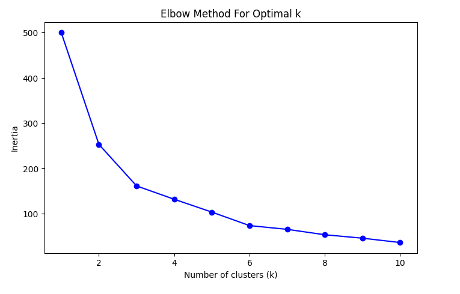

# NASDAQ-100 Stock Clustering & Investment Simulator

## Why This Project?

Investors face the challenge of navigating a large number of stocks without clear guidance on which are safe, risky, or high growth. **The NASDAQ-100** contains some of the most important technology and growth companies in the world, but their behavior varies greatly.

This project aims to:

- Analyze **NASDAQ-100 stock** data (2022–2024)
- Measure returns, risk, and volatility
- Group stocks into clusters so investors can easily compare risk/return profiles
- Provide an interactive investment simulator so anyone can test how their money might perform

This project helps transform raw financial data into **actionable insights for decision-making**.

--
## Methodology

**1. Data Collection**

- Stock prices downloaded using yfinance

- Period covered: 2022-01-01 to 2024-12-31

**2. Feature Engineering**

- Daily & Weekly Returns

- Volatility (7-day & 21-day rolling standard deviation)

- Cumulative Returns

- Annualized Returns

**3. Clustering (KMeans)**

- Stocks grouped into 4 categories based on risk & return

- PCA used to reduce dimensions and visualize clusters

**4. Investment Simulator**

- Choose stock(s)

- Enter investment amount

- Select duration (days)

- See expected returns & cluster profile

## Results & Outputs

**1. Optimal Number of Clusters**

The Elbow Method showed that **k=4** was the most suitable choice.

**2. Stock Clusters (Risk vs Return)**

Using PCA, stocks were projected in 2D space. Each color shows a different cluster:

- **Stable Performers →** Consistent but moderate growth

- **High Growth, High Risk →** Potentially large gains but very volatile

- **Speculative / Volatile →** Extremely unstable, unpredictable stocks

- **Defensive / Low Return →** Safe but with limited growth

**3. Cluster Profiles**

The average characteristics of each cluster:

- **Cluster 0:** Moderate growth with balanced volatility

- **Cluster 1:** Risky with negative average return

- **Cluster 2:** Very high growth potential but very volatile

- **Cluster 3:** Defensive, safer stocks with low but steady returns

**4. Investment Simulator**

The interactive simulator allows you **to test investment strategies:**

- Input investment amount (e.g., $10,000)

- Select one or more stocks

- Choose investment duration (days)

- See expected future value based on annualized return

**Example:**

- $10,000 in AAPL (Defensive / Low Return) over 252 days may yield ~$1,216.00

- $10,000 in NVDA (High Growth, High Risk) could yield much higher ~ $6,642.00, but with more volatility
